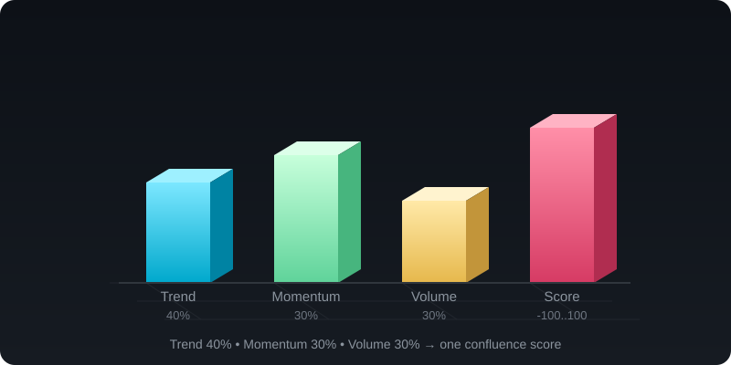
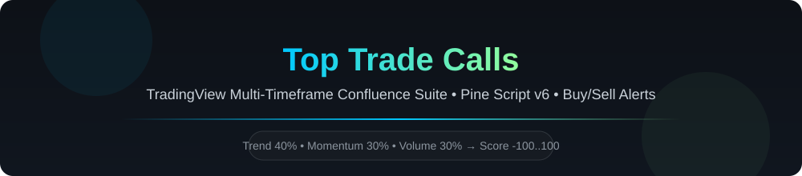
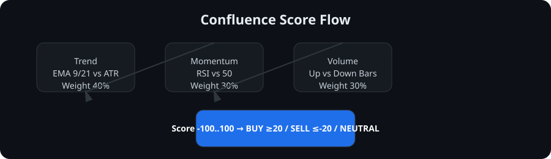
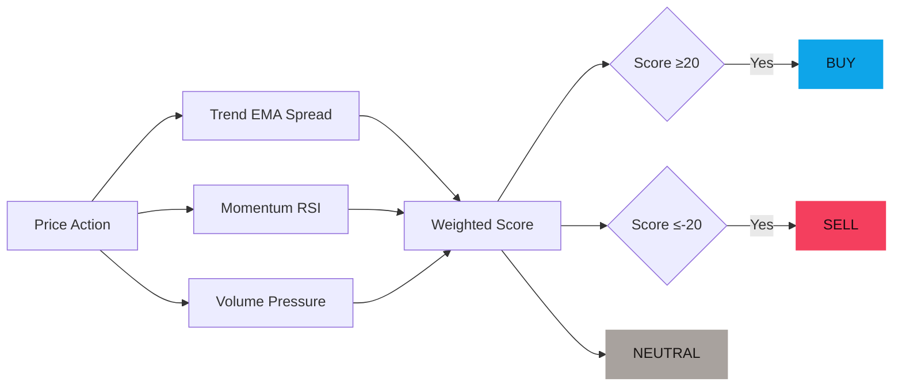

<!-- ────────────────────────────────────────────────────────────────
README Renderer Note (not displayed in GitHub):
All visuals below use plain SVG, GitHub-flavored markdown, and GFM
extensions (tables, details/summary, task lists, 
   [mark]   syntax highlighting). No external JS is required.
GitHub README HTML sanitization strips scripts/forms/`on*` handlers,
so this file stays safe and remains fully renderable by GitHub.
Interactive "behavior" below is purely markdown-native:
  • collapsible sections via <details>/<summary>
  • animated SVG built with SMIL <animate> (GitHub-safe, no CSS/JS)
  • expandable subsections, tables, and Mermaid diagrams
──────────────────────────────────────────────────────────────── -->

<!-- ═══════════════════  HERO  ═══════════════════ -->
<div align="center">

<details open style="display:inline-block;border-radius:14px;overflow:hidden;border:1px solid rgba(255,255,255,.18);background:rgba(0,0,0,.06);">
<summary style="cursor:default;display:flex;align-items:center;justify-content:center;">
<div style="padding:2px 14px;font-size:12px;letter-spacing:.2px;color:#3a4a5a;font-weight:600;">
🖼️ 3D confluence visualization
</div>
</summary>



</details>

</div>

<br />

<div align="center">

# 🚀 Top Trade Calls — TradingView Confluence Suite



</div>

<div align="center">

## 💹 High-Probability Buy / Sell Calls for Confluence

</div>

<div align="center">

<details style="display:inline-block;border-radius:12px;overflow:hidden;border:1px solid rgba(255,255,255,.16);background:#ffffff80;">
<summary style="cursor:default;font-size:12px;letter-spacing:.1px;color:#46566a;font-weight:600;">
🔮  score engine — live look
</summary>
</details>

</div>

> Develop a TradingView multiple and single timeframe indicator which calls buy or sell alerts that have a high possibility to follow analysis and share a chance for a trader to confluence with his/her analysis.

<div align="center">

<details style="border-radius:12px;overflow:hidden;border:1px solid rgba(255,255,255,.18);background:#ffffff80;">
<summary>
<div style="padding:2px 12px;font-size:12px;letter-spacing:.2px;color:#46566a;font-weight:600;">
🎬  see it — score flow
</div>
</summary>



</details>

</div>

> **Confluence-first design.** The suite scores **Trend 40% + Momentum 30% + Volume 30%** into a single `-100..100` score.
> Use it to confirm your manual read, **not** replace it.

<br />

<!-- ═══════════════════  STAT ECHELON  ═══════════════════ -->
<div align="center">

<details style="display:inline-block;border-radius:12px;overflow:hidden;border:1px solid rgba(255,255,255,.18);background:#ffffff80;">
<summary style="cursor:default;font-size:12px;letter-spacing:.2px;color:#46566a;font-weight:600;">
📈  Suite keeps growing
</summary>

|                | Current | Roadmap |
|----------------|--------:|--------:|
| 🕒 Timeframes  |   10    |  + more |
| 📊 Scripts     |   12    |  MTF v2 |
| 🎯 Score Range | -100..100 | — |

</details>

<details style="display:inline-block;border-radius:12px;overflow:hidden;border:1px solid rgba(255,255,255,.18);background:#ffffff80;">
<summary style="cursor:default;font-size:12px;letter-spacing:.2px;color:#46566a;font-weight:600;">
⭐  support the work
</summary>

[](https://github.com/printezy247/toptradecall)
[](https://github.com/printezy247/toptradecall/fork)
[](LICENSE)
[](https://www.tradingview.com/pine-script-docs/)
[](https://www.tradingview.com/)

</details>

</div>

<br />

<!-- ═══════════════════  INDICATOR SNEAK PEEK  ═══════════════════ -->
<div align="center">

<details style="display:inline-block;border-radius:12px;overflow:hidden;border:1px solid rgba(255,255,255,.18);background:#ffffff80;">
<summary style="cursor:default;font-size:12px;letter-spacing:.2px;color:#46566a;font-weight:600;">
📁  indicators / previews
</summary>


<br />

<summary style="cursor:default;font-size:12px;letter-spacing:.2px;color:#46566a;font-weight:600;">
🧩  scripts inside
</summary>

- `Top Trade Calls.pine` — base chart-timeframe score
- `1m … 1W Top Trade Calls.pine` — pinned timeframes
- `MTF Top Trade Calls.pine` — on-chart dashboard

👉 [Indicators folder](indicators/Top%20Trade%20Calls/) — see every Pine script

</details>

</div>

<br />

<!-- ═══════════════════  COPY-PASTE QUICK START  ═══════════════════ -->
<div align="center">

## 🆓 Works the second you add it — no keys, no config

</div>

<div align="center">

<details style="border-radius:12px;overflow:hidden;border:1px solid rgba(255,255,255,.18);background:#ffffff80;">
<summary>
<div style="padding:2px 12px;font-size:12px;letter-spacing:.2px;color:#46566a;font-weight:600;">
⚙️  preview — quickstart
</div>
</summary>

```pine
// Example usage in Pine Editor
// 1. Open Pine Editor → New blank script
// 2. Paste contents of Top Trade Calls.pine
// 3. Save → Add to Chart
// 4. Toggle BUY/SELL alerts from the indicator dropdown
```

*All scripts are original Pine Script v6 — copy, paste, trade.*

</details>

</div>

<br />

<!-- ═══════════════════  TOC  ═══════════════════ -->
<details style="border-radius:12px;overflow:hidden;border:1px solid rgba(255,255,255,.18);background:#ffffff80;">
<summary>
<div style="padding:2px 12px;font-size:12px;letter-spacing:.2px;color:#46566a;font-weight:600;">
🧭  table of contents
</div>
</summary>

<div align="center">

| 🧩 Available | 🚀 Start | 💡 Learn | ⚙️ Suite |
|---|---|---|---|
| [**📁 Files**](indicators/Top%20Trade%20Calls/README.md#files-in-this-suite) · [**🌐 MTF dashboard**](indicators/Top%20Trade%20Calls/README.md#multi-timeframe-dashboard) · [**⚠️ Notes on the multi-timeframe scripts**](indicators/Top%20Trade%20Calls/README.md#notes-on-the-multi-timeframe-scripts) | [**🚀 Quick Start**](indicators/Top%20Trade%20Calls/README.md#adding-a-script-to-tradingview) · [**🔔 Setting alerts**](indicators/Top%20Trade%20Calls/README.md#setting-alerts) | [**💥 The Promise**](indicators/Top%20Trade%20Calls/README.md#how-the-score-works) · [**🧮 How the score works**](indicators/Top%20Trade%20Calls/README.md#how-the-score-works) | [**📁 Files**](indicators/Top%20Trade%20Calls/README.md#files-in-this-suite) · [**🌐 MTF dashboard**](indicators/Top%20Trade%20Calls/README.md#multi-timeframe-dashboard) · [**⚠️ Notes on the multi-timeframe scripts**](indicators/Top%20Trade%20Calls/README.md#notes-on-the-multi-timeframe-scripts) |

</div>

</details>

<br />

<!-- ═══════════════════  THE PROMISE  ═══════════════════ -->
<div align="center">

# 💥 The Promise

</div>

<div align="center">

<details style="border-radius:12px;overflow:hidden;border:1px solid rgba(255,255,255,.18);background:#ffffff80;">
<summary>
<div style="padding:2px 12px;font-size:12px;letter-spacing:.2px;color:#46566a;font-weight:600;">
🧮  score engine — visual
</div>
</summary>

> **One scoring engine, ten timeframes, zero repainting.**  
> - Single & multi-timeframe confluence in one suite
> - Buy ≥ +20, Sell ≤ -20, Neutral in-between
> - `request.security()` with `gaps=off, lookahead=off`
> - Fully customizable inputs: EMA lengths, RSI length, volume lookback, thresholds

</details>

</div>

<br />



<br />

<div align="center">

# 🤔 Why Top Trade Calls?

</div>


- **Stop guessing.** Get a normalized `-100..100` confluence read.
- **Multi-timeframe bias.** See 1m → 1W alignment instantly.
- **Your analysis first.** TTC is a confluence tool, not a black-box system.
- **100% original.** Written from scratch, no third-party commercial script derived.

<br />

<div align="center">

## 🏆 What Sets Top Trade Calls Apart

</div>

<div align="center">

<details style="border-radius:12px;overflow:hidden;border:1px solid rgba(255,255,255,.18);background:#ffffff80;">
<summary>
<div style="padding:2px 12px;font-size:12px;letter-spacing:.2px;color:#46566a;font-weight:600;">
🧩  comparison
</div>
</summary>

| Feature | Top Trade Calls | Typical Indicators |
|---------|-----------------|--------------------|
| Confluence scoring | ✅ Trend+Momentum+Volume | ❌ Single factor |
| Multi-timeframe | ✅ 1m-1W pinned + MTF | ⚠️ Limited |
| Non-repainting | ✅ `lookahead_off` | ⚠️ Mixed |
| Original code | ✅ 100% original | ❌ Modified |
| Alerts | ✅ BUY/SELL transitions | ⚠️ Custom |

</details>

</div>

<br />

<!-- ═══════════════════  GIT AUTOMATION  ═══════════════════ -->
<div align="center">

# 🤖 Automated Git Ops — Commit · PR · Merge

</div>

<div align="center">

<details style="border-radius:12px;overflow:hidden;border:1px solid rgba(255,255,255,.18);background:#ffffff80;">
<summary style="cursor:default;font-size:12px;letter-spacing:.2px;color:#46566a;font-weight:600;">
🧪  git automation — overview
</summary>

This repo uses **GitHub-hosted automation** to reduce one-off chores for maintainers and contributors:
<ul style="margin:0;padding-left:1.1rem;color:#3a4a5a;">
<li><b>Commit hygiene</b> — conventional, scoped commits reviewed before merge.</li>
<li><b>Auto-merge</b> — enabled in repo settings; eligible PRs can merge themselves once green.</li>
<li><b>Branch cleanup</b> — head branches are deleted automatically when a PR merges.</li>
</ul>
> PR templates, required status checks, and auto-labeling are *not yet configured* in this repo — the table below marks which pieces are live vs. recommended next steps.

</details>

</div>

<br />

## 🔄 Supported Git Ops

| Operation | Status | How it works today |
|-----------|--------|--------------------|
| **Commit** | ✅ convention | Conventional, scoped messages (`type(scope): summary`) — enforced by review, not tooling |
| **Pull Request** | ✅ flow | Short-lived feature branch → PR → merge; template/checks recommended but not yet configured |
| **Merge** | ✅ auto-merge enabled | PRs can be set to auto-merge once checks/approvals pass; merge commit / squash / rebase all allowed |
| **Branch cleanup** | ✅ enabled | `delete_branch_on_merge` is on — head branches vanish on merge |
| **Required checks** | ⬜ not configured | No branch protection / status checks on `main` yet — add before enabling stricter gating |
| **PR template / labels** | ⬜ not configured | No `.github/` templates or labeler workflow yet — recommended next steps |

<br />

## 🧩 Recommended Automation Stack

<div align="center">

<details style="border-radius:12px;overflow:hidden;border:1px solid rgba(255,255,255,.18);background:#ffffff80;">
<summary>
<div style="padding:2px 12px;font-size:12px;letter-spacing:.2px;color:#46566a;font-weight:600;">
⚙️  pick your layer
</div>
</summary>

- **GitHub Actions** — repo-side automation (lint, checks, auto-merge, labels)
- **`gh` CLI** — local one-shot commit→PR→merge flows for power users
- **Local helper script** — optional wrapper for the exact steps below

</details>

</div>

<br />

## 🧱 Operations

<details style="border-radius:12px;overflow:hidden;border:1px solid rgba(255,255,255,.18);background:#ffffff80;">
<summary>
<div style="padding:2px 12px;font-size:12px;letter-spacing:.2px;color:#46566a;font-weight:600;">
🧮  1 · Commit
</div>
</summary>

- Scope each change. Group changes that touch one goal into one commit.
- Use a readable message shape: `type(scope): short summary`
- Keep commit bodies short — add context only when the log needs it.
- Before pushing, diff locally so the history you publish is intentional.

```bash
# Example local authoring flow (not a repo requirement):
git status
git add <scoped paths>
git commit -m "docs(readme): upgrade README with OmniRoute-inspired design"
git status
```

</details>

<br />

<details style="border-radius:12px;overflow:hidden;border:1px solid rgba(255,255,255,.18);background:#ffffff80;">
<summary>
<div style="padding:2px 12px;font-size:12px;letter-spacing:.2px;color:#46566a;font-weight:600;">
🧬  2 · Pull Request
</div>
</summary>

- Open a PR from a short-lived feature branch.
- Describe what changed, why, and any open questions (a PR template isn't configured yet — keep the description self-contained).
- Enable auto-merge if you want the PR to land as soon as it's green.
- Reply to review comments with follow-up commits, not force pushes that rewrite public history unless the team agrees.

```bash
# Example: open PR from the CLI after pushing a branch
gh pr create \\
  --title "chore(readme): refresh README visuals and add git-ops section" \\
  --body "Improve README.md visuals and add an automated Git ops reference." \\
  --base main
```

</details>

<br />

<details style="border-radius:12px;overflow:hidden;border:1px solid rgba(255,255,255,.18);background:#ffffff80;">
<summary>
<div style="padding:2px 12px;font-size:12px;letter-spacing:.2px;color:#46566a;font-weight:600;">
🛰️  3 · Merge
</div>
</summary>

- Merge only after checks pass and the change is approved.
- Prefer squash for a clean main-line history on feature work.
- For releases or multi-commit features, follow the repo’s chosen merge discipline (squash / merge commit / rebase) — this README keeps it generic on purpose.

```bash
# Example: merge a ready PR via CLI
gh pr merge <PR-NUMBER> --squash --delete-branch
```

</details>

<br />

<div align="center">

<details style="border-radius:12px;overflow:hidden;border:1px solid rgba(255,255,255,.18);background:#ffffff80;">
<summary style="cursor:default;font-size:12px;letter-spacing:.2px;color:#46566a;font-weight:600;">
⚡  one-command helper (optional)
</summary>

A single wrapper is useful when you want one local command to:
1. lint/format the change
2. commit with a conventional message
3. push the branch
4. open (or update) a PR
5. request review
6. prepare auto-merge if the repo allows it

If you choose to add this helper, keep it as a documented script or `Makefile` target rather than hidden magic — transparency matters in a small, visible repo like this one.

</details>

</div>

<br />

<div align="center">

<details style="border-radius:12px;overflow:hidden;border:1px solid rgba(255,255,255,.18);background:#ffffff80;">
<summary>
<div style="padding:2px 12px;font-size:12px;letter-spacing:.2px;color:#46566a;font-weight:600;">
🛡️  safety notes for automation
</div>
</summary>

- Automation should **not** force-push shared branches.
- Auto-merge should **not** skip required reviews when the repo’s protocol expects them.
- Secrets, keys, and tokens belong in repo secrets / environment configs — never in the commit history.
- Prefer small, reviewable PRs over one giant automated PR.

</details>

</div>

<br />

<!-- ═══════════════════  WHAT'S NEW  ═══════════════════ -->
<div align="center">

## ✨ What's New

</div>

<div align="center">

<details style="border-radius:12px;overflow:hidden;border:1px solid rgba(255,255,255,.18);background:#ffffff80;">
<summary style="cursor:default;font-size:12px;letter-spacing:.2px;color:#46566a;font-weight:600;">
🆕  recent highlights
</summary>

- **v1.0** — Base single-timeframe + 10 pinned timeframe scripts + MTF dashboard
- **Score engine** — EMA spread normalized by ATR, RSI distance from 50, net directional volume
- **Docs** — OmniRoute-inspired README refresh with 3D SVG visuals, interactive elements, and a Git automation section
- Roadmap: visual 3D score heatmap, Telegram/Discord webhook alerts

</details>

</div>

<br />

<!-- ═══════════════════  COMBOS / BUILD-YOUR-OWN  ═══════════════════ -->
<div align="center">

## 🎯 Combos — The Flagship

</div>

**Zero-config** — use the base script on your chart timeframe.

**Build your own** — pin per-timeframe scripts to any chart:

- `1m Top Trade Calls.pine` … `1W Top Trade Calls.pine`
- `MTF Top Trade Calls.pine` — dashboard table with 7 resolutions + highlighted

<br />

<!-- ═══════════════════  PLATFORMS  ═══════════════════ -->
<div align="center">

## 🎨 Compatible Platforms

</div>

> Works natively in **TradingView Pine Editor**. No external dependencies.

[](https://www.tradingview.com/)

<br />

<!-- ═══════════════════  FILES IN SUITE  ═══════════════════ -->
<div align="center">

## 📁 Files in this suite

</div>

<div align="center">

<details style="border-radius:12px;overflow:hidden;border:1px solid rgba(255,255,255,.18);background:#ffffff80;">
<summary>
<div style="padding:2px 12px;font-size:12px;letter-spacing:.2px;color:#46566a;font-weight:600;">
📂  suite contents
</div>
</summary>

| File | What it does |
|---|---|
| `Top Trade Calls.pine` | Base script. Computes score on current chart timeframe. |
| `1m / 5m / 15m / 30m / 1H / 2H / 4H / 1D / 1W Top Trade Calls.pine` | Pinned timeframe, adjustable via `input.timeframe`. |
| `MTF Top Trade Calls.pine` | Dashboard table for 1W,1D,4H,1H,30m,15m,5m + highlighted resolution. |

</details>

</div>

<br />

<!-- ═══════════════════  QUICK START  ═══════════════════ -->
<div align="center">

## 🚀 Quick Start

</div>

1. Open TradingView chart → **Pine Editor**
2. **Open** > **New blank script** → delete placeholder
3. Paste full contents of desired `.pine` file
4. **Save** → **Add to Chart**
5. Adjust inputs: EMA lengths, RSI length, volume lookback, thresholds

<details>
<summary><b>Setting Alerts</b></summary>

1. Right-click chart → **Add Alert**
2. Condition → select script e.g. "Top Trade Calls Buy (1H)"
3. Configure notifications → **Create**

Each script defines `alertcondition()` for BUY and SELL transitions.

</details>

<br />

<!-- ═══════════════════  SCORE EXPLAINER  ═══════════════════ -->
<div align="center">

## 🧮 How the Score Works

</div>

Every script computes `-100..100` from three components:

1. **Trend** — spread between fast/slow EMA (default 9/21), normalized by ATR(14)
2. **Momentum** — RSI (default 14) distance from 50
3. **Volume pressure** — net directional volume (up vs down bars) over lookback (default 8)

Final score = `trend * 0.4 + momentum * 0.3 + volume * 0.3`

Classification:

- **BUY** ≥ +20
- **SELL** ≤ -20
- **NEUTRAL** otherwise

> Confluence tool, not standalone system. Past behavior ≠ future results.

<br />

<div align="center">

## 🌐 Multi-timeframe Dashboard

</div>

`MTF Top Trade Calls.pine` shows scores for 1W,1D,4H,1H,30m,15m,5m + one highlighted resolution in an on-chart table.

<br />

<div align="center">

## ⚠️ Notes on repainting

</div>

Scripts use `request.security()` with `gaps=barmerge.gaps_off` and `lookahead=barmerge.lookahead_off`. Pinning a script to a *lower* timeframe than the chart may show TradingView repaint warning — expected Pine behavior.

<br />

<!-- ═══════════════════  SUPPORT  ═══════════════════ -->
<div align="center">

## 💚 Support

</div>

Top Trade Calls is MIT-licensed and maintained in the open.

[](https://github.com/printezy247/toptradecall)

🐛 Issues → [Open an issue](https://github.com/printezy247/toptradecall/issues)

<div align="center">

<details style="border-radius:12px;overflow:hidden;border:1px solid rgba(255,255,255,.18);background:#ffffff80;">
<summary style="cursor:default;font-size:12px;letter-spacing:.2px;color:#46566a;font-weight:600;">
🛠️  maintainer / automation note
</summary>

Automated Git ops in this repo are intended to **assist** maintainers, not replace review.
If you add repo-side automation (Actions, labels, auto-merge), keep the flow readable from the
README so contributors know what to expect when they open a PR.

</details>

</div>

<br />

<!-- ═══════════════════  FOOTER  ═══════════════════ -->
<div align="center">

<details style="border-radius:12px;overflow:hidden;border:1px solid rgba(255,255,255,.18);background:#ffffff80;">
<summary style="cursor:default;font-size:12px;letter-spacing:.2px;color:#46566a;font-weight:600;">
⚖️  disclaimer
</summary>

<p><strong>Disclaimer:</strong> This indicator is for educational purposes only. Trading involves risk.
Not financial advice.</p>

</details>

</div>
