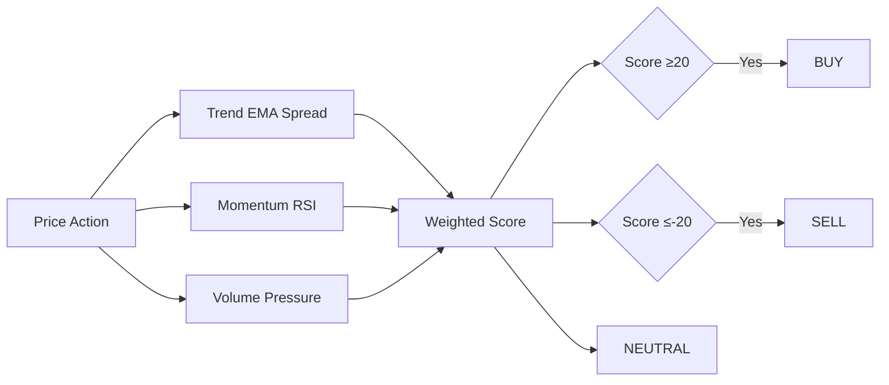

<div align="center">


<br/>

# 🚀 Top Trade Calls — TradingView Confluence Suite


</div>

<div align="center">

## 💹 High-Probability Buy/Sell Calls for Confluence

</div>

> Develop a TradingView multiple and single timeframe indicator which calls buy or sell alerts that have a high possibility to follow analysis and share a chance for a trader to confluence with his/her analysis.


> **Confluence-first design.** The suite scores **Trend 40% + Momentum 30% + Volume 30%** into a single `-100..100` score. Use it to confirm your manual read, not replace it.

<br/>

<div align="center">

### ⭐ Star the repo if Top Trade Calls helps your analysis

</div>

[](https://github.com/printezy247/toptradecall)
[](https://github.com/printezy247/toptradecall/fork)
[](LICENSE)
[](https://www.tradingview.com/pine-script-docs/)
[](https://www.tradingview.com/)

<br/>

<div align="center">

## 📈 The Suite Keeps Growing

|                | Current | Roadmap |
|----------------|--------:|--------:|
| 🕒 Timeframes  |   10    |  + more |
| 📊 Scripts     |   12    |  MTF v2 |
| 🎯 Score Range | -100..100 | — |

**→ [Indicators](indicators/Top%20Trade%20Calls/) — see all Pine scripts**

</div>

<br/>

## 🧩 Available

[](https://www.tradingview.com/pine-script-docs/)
[](LICENSE)
[](indicators/Top%20Trade%20Calls/)

<table>
  <tr>
    <td align="right"><b>🚀 Start</b></td>
    <td align="center"><a href="#-quick-start">🚀 Quick Start</a></td>
    <td align="center"><a href="#-add-to-tradingview">📦 Install</a></td>
    <td align="center"><a href="#-alerts">🔔 Alerts</a></td>
  </tr>
  <tr>
    <td align="right"><b>💡 Learn</b></td>
    <td align="center"><a href="#-the-promise">💥 The Promise</a></td>
    <td align="center"><a href="#-why-top-trade-calls">🤔 Why TTC</a></td>
    <td align="center"><a href="#-how-the-score-works">🧮 Score</a></td>
  </tr>
  <tr>
    <td align="right"><b>⚙️ Suite</b></td>
    <td align="center"><a href="#-files-in-this-suite">📁 Files</a></td>
    <td align="center"><a href="#-multi-timeframe-dashboard">🌐 MTF</a></td>
    <td align="center"><a href="#-notes-on-repainting">⚠️ Notes</a></td>
  </tr>
</table>

<br/>

<div align="center">

## 🆓 Works the second you add it — no keys, no config

</div>


```pine
// Example usage in Pine Editor
// 1. Open Pine Editor → New blank script
// 2. Paste contents of Top Trade Calls.pine
// 3. Save → Add to Chart
// 4. Toggle BUY/SELL alerts from the indicator dropdown
```

<sub>All scripts are original Pine Script v6 — copy, paste, trade.</sub>

<br/>

<div align="center">

# 💥 The Promise

</div>

> **One scoring engine, ten timeframes, zero repainting.**  
> - Single & multi-timeframe confluence in one suite
> - Buy ≥ +20, Sell ≤ -20, Neutral in-between
> - `request.security()` with `gaps=off, lookahead=off`
> - Fully customizable inputs: EMA lengths, RSI length, volume lookback, thresholds



<br/>

<div align="center">

# 🤔 Why Top Trade Calls?

</div>


- **Stop guessing.** Get a normalized `-100..100` confluence read.
- **Multi-timeframe bias.** See 1m → 1W alignment instantly.
- **Your analysis first.** TTC is a confluence tool, not a black-box system.
- **100% original.** Written from scratch, no third-party commercial script derived.

<br/>

## 🎯 Combos — The Flagship

**Zero-config** — use the base script on your chart timeframe.

**Build your own** — pin per-timeframe scripts to any chart:

- `1m Top Trade Calls.pine` … `1W Top Trade Calls.pine`
- `MTF Top Trade Calls.pine` — dashboard table with 7 resolutions + highlighted

<br/>

<div align="center">

## 🏆 What Sets Top Trade Calls Apart

</div>

| Feature | Top Trade Calls | Typical Indicators |
|---------|-----------------|--------------------|
| Confluence scoring | ✅ Trend+Momentum+Volume | ❌ Single factor |
| Multi-timeframe | ✅ 1m-1W pinned + MTF | ⚠️ Limited |
| Non-repainting | ✅ `lookahead_off` | ⚠️ Mixed |
| Original code | ✅ 100% original | ❌ Modified |
| Alerts | ✅ BUY/SELL transitions | ⚠️ Custom |

<br/>

## ✨ What's New

- **v1.0** — Base single-timeframe + 10 pinned timeframe scripts + MTF dashboard
- **Score engine** — EMA spread normalized by ATR, RSI distance from 50, net directional volume
- Roadmap: visual 3D score heatmap, Telegram/Discord webhook alerts

<br/>

## 🎨 Compatible Platforms

> Works natively in **TradingView Pine Editor**. No external dependencies.

[](https://www.tradingview.com/)

<br/>

## 📁 Files in this suite

| File | What it does |
|---|---|
| `Top Trade Calls.pine` | Base script. Computes score on current chart timeframe. |
| `1m / 5m / 15m / 30m / 1H / 2H / 4H / 1D / 1W Top Trade Calls.pine` | Pinned timeframe, adjustable via `input.timeframe`. |
| `MTF Top Trade Calls.pine` | Dashboard table for 1W,1D,4H,1H,30m,15m,5m + highlighted resolution. |

<br/>

## 🚀 Quick Start

1. Open TradingView chart → **Pine Editor**
2. **Open** > **New blank script** → delete placeholder
3. Paste full contents of desired `.pine` file
4. **Save** → **Add to Chart**
5. Adjust inputs: EMA lengths, RSI length, volume lookback, thresholds

<details open>
<summary><b>Setting Alerts</b></summary>

1. Right-click chart → **Add Alert**
2. Condition → select script e.g. "Top Trade Calls Buy (1H)"
3. Configure notifications → **Create**

Each script defines `alertcondition()` for BUY and SELL transitions.
</details>

<br/>

## 🧮 How the Score Works

Every script computes `-100..100` from three components:

1. **Trend** — spread between fast/slow EMA (default 9/21), normalized by ATR(14)
2. **Momentum** — RSI (default 14) distance from 50
3. **Volume pressure** — net directional volume (up vs down bars) over lookback (default 8)

Final score = `trend * 0.4 + momentum * 0.3 + volume * 0.3`

Classification:
- **BUY** ≥ +20
- **SELL** ≤ -20
- **NEUTRAL** otherwise

> Confluence tool, not standalone system. Past behavior ≠ future results.

<br/>

## 🌐 Multi-timeframe Dashboard

`MTF Top Trade Calls.pine` shows scores for 1W,1D,4H,1H,30m,15m,5m + one highlighted resolution in an on-chart table.

<br/>

## ⚠️ Notes on repainting

Scripts use `request.security()` with `gaps=barmerge.gaps_off` and `lookahead=barmerge.lookahead_off`. Pinning a script to a *lower* timeframe than the chart may show TradingView repaint warning — expected Pine behavior.

<br/>

<div align="center">

## 💚 Support

Top Trade Calls is MIT-licensed and maintained in the open.

[](https://github.com/printezy247/toptradecall)

🐛 Issues → [Open an issue](https://github.com/printezy247/toptradecall/issues)

</div>

<br/>

<p><strong>Disclaimer:</strong> This indicator is for educational purposes only. Trading involves risk. Not financial advice.</p>
